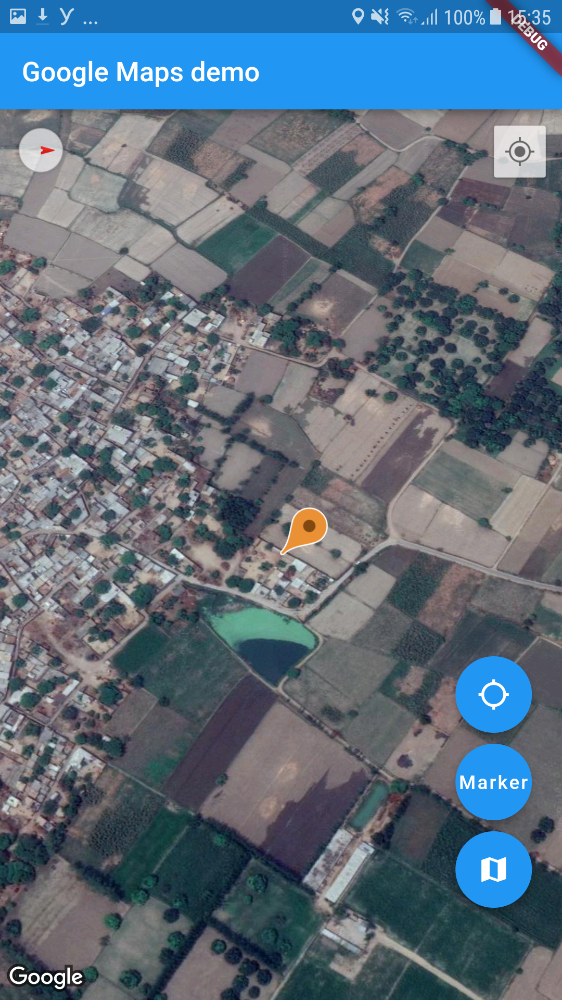

# flutter_map_demo

A Flutter application with the simple code example to implement the google map.
There is three floating button 
1. Camera position- It will show the lattitue and longitude of camera position in Alert dialog.
2. Marker- Create a marker with dummy title and contnet
3. Toggle Button- Toggle the map type norma/sattelite.

## Screenshots

## Getting Started

This project is a starting point for a Flutter application.

A few resources to get you started if this is your first Flutter project:

- [Lab: Write your first Flutter app](https://flutter.io/docs/get-started/codelab)
- [Cookbook: Useful Flutter samples](https://flutter.io/docs/cookbook)

For help getting started with Flutter, view our 
[online documentation](https://flutter.io/docs), which offers tutorials, 
samples, guidance on mobile development, and a full API reference.
